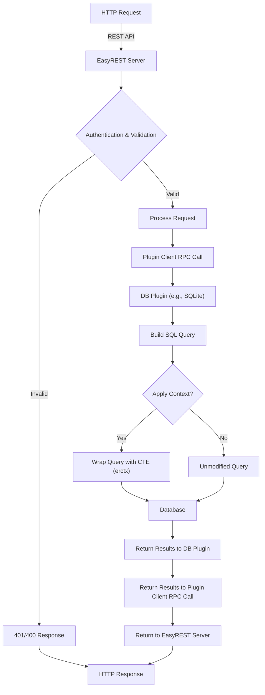

# EasyREST

EasyREST is a lightweight, extensible REST service that provides a unified API for performing CRUD and aggregating queries on relational databases. Its key innovation is the use of a plugin system that allows you to connect to virtually any database (or data source) simply by writing a plugin that conforms to the EasyREST interface. Out of the box, an SQLite plugin is provided, but you can easily add plugins for MySQL, PostgreSQL, Oracle, or any other database.

EasyREST handles authentication via JWT, validates and sanitizes request parameters at the controller level, and then passes 100% safe SQL expressions to the plugins. The service supports complex queries including aggregations, aliasing, advanced WHERE conditions, and even the use of context variables (passed via a Common Table Expression or CTE) that allow you to influence query behavior dynamically.

---

## Table of Contents

- [Architecture](#architecture)
  - [Overall Architecture Diagram](#overall-architecture-diagram)
  - [Plugin Communication](#plugin-communication)
  - [Authentication and Authorization](#authentication-and-authorization)
- [Query Capabilities](#query-capabilities)
  - [Selecting Fields and Aliasing](#selecting-fields-and-aliasing)
  - [Aggregating Queries](#aggregating-queries)
  - [WHERE Conditions](#where-conditions)
  - [Context Variables via erctx](#context-variables-via-erctx)
  - [Data Insertion, Updates, and Deletion](#data-insertion-updates-and-deletion)
- [Configuration Parameters](#configuration-parameters)
- [Examples](#examples)
  - [Multiple SQLite Databases with Different Structures](#multiple-sqlite-databases-with-different-structures)
- [Building and Running](#building-and-running)
  - [Building the Server](#building-the-server)
  - [Building a Plugin (SQLite)](#building-a-plugin-sqlite)
  - [Running Tests and Benchmarks](#running-tests-and-benchmarks)
- [License](#license)

---

## Architecture

EasyREST’s design emphasizes simplicity, extensibility, and security. It follows a modular architecture where the core server is responsible for:

- **Authentication & Authorization:** Validates JWT tokens and verifies scopes.
- **Parameter Validation:** Ensures that all parameters (select, where, ordering, etc.) are safe before forwarding to the plugins.
- **Plugin Orchestration:** Loads and manages DB plugins based on environment configuration.  
- **Context Propagation:** Extracts contextual information (e.g., timezone, HTTP headers, JWT claims) from each request and passes them to plugins via a CTE (Common Table Expression) named `erctx`.

### Overall Architecture Diagram



### Plugin Communication

- **RPC Communication:** EasyREST uses Hashicorp's [go-plugin](https://github.com/hashicorp/go-plugin) system to load and communicate with plugins. The server launches plugin processes based on environment variables (e.g. `ER_DB_TEST`) and establishes an RPC connection.
- **Data Exchange:** The server sends validated and sanitized SQL expressions and additional context data to the plugin. This context is injected into the query using a CTE so that plugins can optionally use the provided parameters.
- **Type Registration:** For secure and reliable encoding/decoding over RPC, custom types (e.g., `time.Time` and flattened JWT claims) are registered with the gob package.

### Authentication and Authorization

- **JWT Authentication:** Requests must include a Bearer token. The server verifies the token signature (using a secret from configuration) and extracts claims.
- **Scope-based Authorization:** The service verifies that the token’s claims include the required scope (e.g., `users-read` for GET operations, `users-write` for modifications or wide `read` and `write` for all table names).  
- **Token Claims:** The claims are flattened and passed to plugins (under the key `claims` in the context map) so that plugins can leverage user-specific information if needed.

---

## Query Capabilities

EasyREST supports a wide range of SQL query features by converting URL query parameters into SQL expressions after performing strict validation.

### Selecting Fields and Aliasing

- **Basic Selection:**  
  Use the `select` parameter to specify one or more columns. For example:  
  ```
  /api/test/users/?select=id,name
  ```
- **Field Aliasing:**  
  To alias a column, use the syntax `alias:field`.  
  For example,  
  ```
  /api/test/users/?select=username:name
  ```  
  becomes  
  ```sql
  SELECT name AS username FROM users
  ```
- **SQL Functions:**  
  Aggregation functions are supported. For instance,  
  ```
  /api/test/orders/?select=count()
  ```  
  results in:  
  ```sql
  SELECT COUNT(*) AS count FROM orders
  ```
  You can also use functions with aliasing:  
  ```
  /api/test/orders/?select=total:amount.sum(),order_date
  ```  
  which translates to:  
  ```sql
  SELECT SUM(amount) AS total, order_date FROM orders GROUP BY order_date
  ```

### Aggregating Queries

- EasyREST supports common SQL aggregate functions such as `COUNT()`, `SUM()`, `AVG()`, `MIN()`, and `MAX()`.
- Aggregated fields are automatically excluded from the GROUP BY clause.
- Non-aggregated fields that appear in the `select` parameter are added to a GROUP BY clause automatically.

### WHERE Conditions

- **Syntax:**  
  Conditions are specified using parameters prefixed with `where.`. For example:  
  ```
  /api/test/users/?where.eq.name=Alice
  ```
  This generates:  
  ```sql
  WHERE name = 'Alice'
  ```
- **Operators:**  
  Supported operators include:
  - `eq` (equals)
  - `neq` (not equals)
  - `lt` (less than)
  - `lte` (less than or equals)
  - `gt` (greater than)
  - `gte` (greater than or equals)
  - `like` (LIKE)
  - `ilike` (ILIKE)
  - `is` (IS)
  - `in` (IN)
- **erctx Fields:**  
  You can compare a column with a context variable. For example,  
  ```
  /api/test/users/?where.eq.name=erctx.claims_sub
  ```  
  Here, the string `erctx.claims_sub` is not treated as a literal but is injected into the SQL query as a column reference from the CTE.  
- **Validation:**  
  The server validates that only allowed operators are used and that field names (including those starting with `erctx.`) are valid.

### Context Variables via erctx

- **Context Extraction:**  
  The server extracts contextual information from the HTTP request. Context keys include:
  - **timezone:** Extracted from the `Prefer` header (e.g., `Prefer: timezone=America/Los_Angeles`). If not provided, a default value (e.g., "GMT") from the server configuration is used.
  - **headers:** A map of all HTTP headers, with keys converted to lowercase and values concatenated if repeated.
  - **claims:** The JWT token claims, flattened to a plain map with lowercase keys.
- **CTE Injection:**  
  If any select field or where condition references a string beginning with `erctx.`, the server wraps the SQL query with a CTE named `erctx` that provides columns for each flattened context variable.
  
  For example, given a context:
  ```json
  {
    "timezone": "America/Los_Angeles",
    "claims": { "sub": "Alice" }
  }
  ```
  The server may wrap a query like:
  ```sql
  SELECT id, name FROM users WHERE name = erctx.claims_sub
  ```
  as:
  ```sql
  WITH erctx AS (
      SELECT ? AS timezone, ? AS claims_sub
  )
  SELECT id, name FROM users, erctx WHERE name = erctx.claims_sub
  ```
  The context values are passed as parameters.

### Data Insertion, Updates, and Deletion

- **Insertion (POST):**  
  Data is passed as JSON in the request body. The server builds an `INSERT INTO` statement after validating the column names. If any value in the data references a context variable (contains `"erctx."`), the INSERT query is wrapped with a CTE.
- **Update (PATCH):**  
  The update request requires a JSON object in the request body (with columns to update) and optional where conditions in the query string. Similar to insertion, if the data or where conditions reference a context variable, the query is wrapped with a CTE.
- **Deletion (DELETE):**  
  Deletion is based solely on the where parameters. If any where value contains `"erctx."`, the query is wrapped with a CTE.

---

## Configuration Parameters

EasyREST is configured via environment variables. The primary configuration parameters include:

- **ER_PORT:**  
  The port on which the server listens (default: `8080`).

- **ER_CHECK_SCOPE:**  
  Enables or disables scope checking. When set to `"1"`, the server verifies that the JWT token has the proper scopes (e.g., `users-read` for GET and `users-write` for modifications). If unset or any other value, scope checking is disabled (default: enabled).

- **ER_TOKEN_SECRET:**  
  The secret used to sign/verify JWT tokens.

- **ER_TOKEN_USER_SEARCH:**  
  The claim key used to extract the user ID from the JWT token (default: `"sub"`).

- **ER_NO_PLUGIN_LOG:**  
  Controls plugin logging. When set to `"1"`, plugin logging is enabled; otherwise, it is disabled.

- **ER_DEFAULT_TIMEZONE:**  
  The default timezone to use if none is provided via the `Prefer` header (e.g., `"GMT"` or `"America/New_York"`).

- **ER_DB_<NAME>:**  
  For each database connection, you set an environment variable in the form `ER_DB_TEST`, `ER_DB_PROD`, etc. The value should be in the format:  
  ```
  sqlite://path/to/database.db
  ```
  or for other plugins, a URI scheme that the plugin understands.

---

## Examples

### Multiple SQLite Databases with Different Structures

Imagine you have two SQLite databases:

1. **Test Database (`ER_DB_TEST`):**  
   - **Path:** `./test.db`
   - **Table:** `users`  
     Structure: `id` (auto-increment), `name` (text), `update_field` (text)

2. **Orders Database (`ER_DB_ORDERS`):**  
   - **Path:** `./orders.db`
   - **Table:** `orders`  
     Structure: `id` (auto-increment), `items` (integer), `order_date` (date), `amount` (real)

Set environment variables:
```bash
export ER_DB_TEST="sqlite://./test.db"
export ER_DB_ORDERS="sqlite://./orders.db"
export ER_TOKEN_SECRET="your-secret"
export ER_TOKEN_USER_SEARCH="sub"
export ER_DEFAULT_TIMEZONE="GMT"
```

**Query Examples:**

- **Selecting Fields with Aliases:**
  ```
  GET /api/test/users/?select=username:name,update_field
  ```
  →  
  ```sql
  SELECT name AS username, update_field FROM users;
  ```

- **Aggregating Queries:**
  ```
  GET /api/orders/?select=total:amount.sum(),order_date
  ```
  →  
  ```sql
  SELECT SUM(amount) AS total, order_date FROM orders GROUP BY order_date;
  ```

- **Where Conditions with Context Variables:**
  Suppose the JWT token has a claim `"sub": "Alice"`. The following request:
  ```
  GET /api/test/users/?select=id,name&where.eq.name=erctx.claims_sub
  ```
  With a context built from the token claims, the query is wrapped with a CTE so that `erctx.claims_sub` references the value `"Alice"`.

- **Data Insertion:**
  ```
  POST /api/test/users/
  Body: [{"name": "Bob", "update_field": "new"}]
  ```
  If one of the field values references `erctx.` (for example, if you want to set a column based on a context variable), the query is wrapped accordingly.

---

## Building and Running

### Building the Server

Ensure you have Go installed (version 1.23 or later).

To build the server, run:

```bash
make server
```

This will produce an executable named `easyrest-server` in `bin` folder.

### Building a Plugin (SQLite)

To build the SQLite plugin, navigate to the plugin folder and run:

```bash
make plugin-sqlite
```

This will produce an executable named `easyrest-plugin-sqlite` that the server will look for (via `exec.LookPath`) when an environment variable like `ER_DB_TEST` is set to a URI starting with `sqlite://`.

### Running Tests and Benchmarks

EasyREST includes an extensive test suite. To run all tests, use:

```bash
make test
```

To run benchmarks:

```bash
make bench
```

The tests include unit tests for CRUD operations, query aggregation, and context propagation. Make sure your environment variables are set appropriately for testing.

---

## Developing External Plugins

To create an external plugin (e.g., a MySQL plugin):

1. **Create a New Repository:**  
   For instance, create a repository named `easyrest-plugin-mysql`.

2. **Import the Common Module:**  
   In your plugin’s `go.mod`, add:
   ```go
   require github.com/onegreyonewhite/easyrest v0.1.0
   ```
   Then, import the plugin package:
   ```go
   import easyrest "github.com/onegreyonewhite/easyrest/plugin"
   ```

3. **Implement the Interface:**  
   Implement the `DBPlugin` interface defined in `easyrest/plugin`. Use the same handshake configuration (accessible as `easyrest.Handshake`).

4. **Structure Your Repository:**  
   - Have a main package (e.g., `cmd/plugin-mysql/main.go`) that registers your plugin using:
     ```go
     func main() {
         impl := &mysqlPlugin{}
         plugin.Serve(&plugin.ServeConfig{
             HandshakeConfig: easyrest.Handshake,
             Plugins: map[string]plugin.Plugin{
                 "db": &easyrest.DBPluginPlugin{Impl: impl},
             },
         })
     }
     ```
   - Organize your code so that the core logic is in packages that can be independently tested.

5. **Build and Deploy:**  
   Build the plugin binary with `go build` and ensure it is discoverable by EasyREST (via naming conventions and PATH configuration).

### Changes in EasyREST Repository

In the EasyREST core, nothing changes except that you now reference plugins by their binary names (e.g., `easyrest-plugin-mysql`) using `exec.LookPath`. Document the expected naming convention so that external plugins can be built and integrated independently.

---

## Summary

EasyREST is a simple yet powerful service for exposing database functionality via a REST API. It is built to be secure by validating and sanitizing all inputs on the server side, while delegating the actual query execution to plugins. The plugin architecture makes it easy to support multiple databases, and the context feature (via CTEs) allows you to pass dynamic parameters (like timezone, headers, and token claims) to your queries. With flexible query capabilities—including field aliasing, aggregate functions, and complex WHERE conditions—EasyREST provides a robust foundation for building data-driven applications.

Feel free to contribute or extend the functionality by writing new plugins for different databases or enhancing the query capabilities. Enjoy using EasyREST!

---

## License

EasyREST is licensed under the terms of the Apache License 2.0.
See the file "LICENSE" for more information.

Copyright 2025 Sergei Kliuikov
